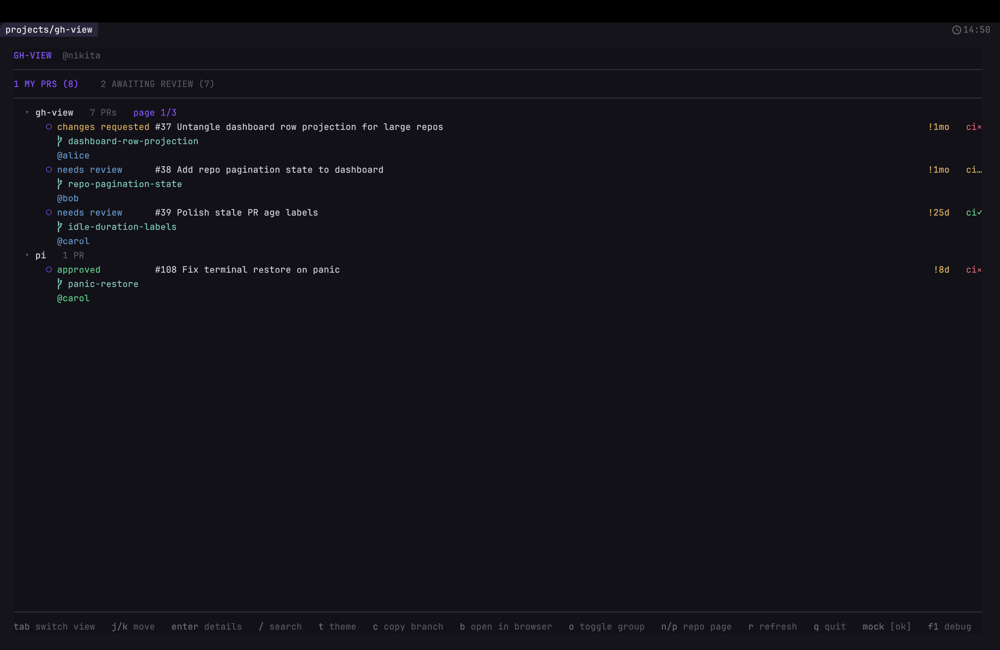
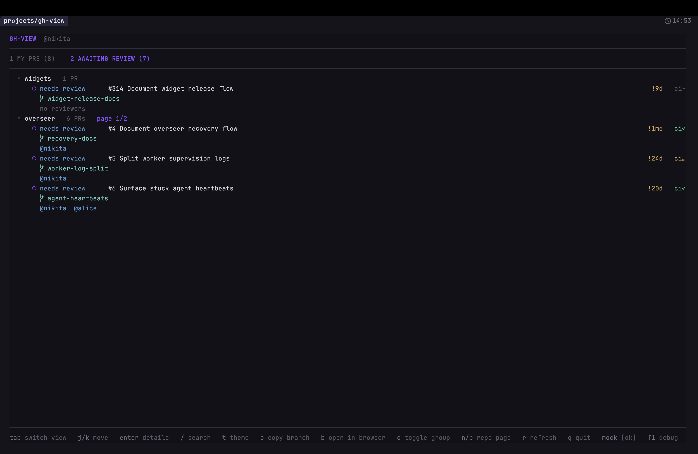
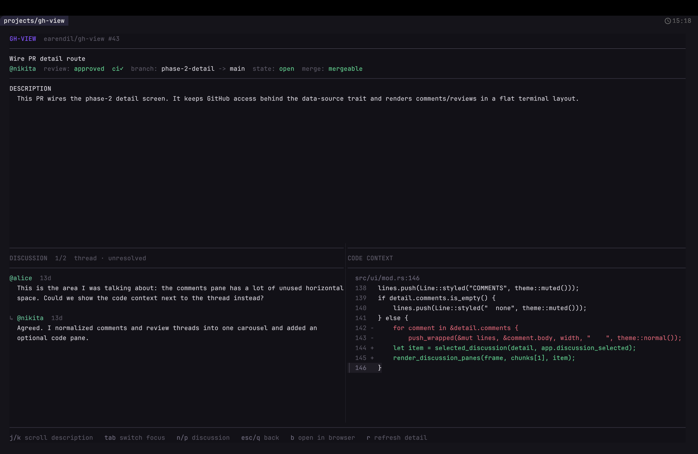

# gh-view

A fast terminal view for GitHub pull requests.

`gh-view` helps you keep track of the PRs you need to care about: pull requests opened by you, pull requests waiting for your review, CI/review state, PR descriptions, comments, review threads, and code context — all from the terminal.

It uses the official GitHub CLI (`gh`) as the transport layer. `gh-view` does not manage GitHub tokens or authentication.

> `gh-view` is an independent project and is not affiliated with, endorsed by, or sponsored by GitHub, Inc.

## Screenshots

### My PRs



### Review Requests



### PR Detail



## Features

- Dashboard grouped by repository
- Separate full-page dashboard views for:
  - PRs opened by you
  - PRs awaiting your direct review or review from one of your teams
- Review-request filters for all, direct, and team requests
- Compact PR rows with review state, CI state, reviewers, and age
- Sticky dashboard identity, navigation, and review-filter header
- Dashboard fuzzy finder for quickly opening loaded PRs by repo, branch, title, author, reviewer, status, or section
- Keyboard and mouse navigation across dashboard, search, detail, and theme controls
- Runtime theme picker with dark and light presets and persistent selection
- PR detail view with description, branch/state/mergeability metadata, and discussion
- Unified discussion carousel for issue comments and review threads
- Review-thread code context rendered next to comments
- Visible active-pane focus cues in PR detail view
- Background loading for PR details and review-thread context
- Mock mode for demos and local UI development without calling GitHub

## Requirements

- GitHub CLI (`gh`)
- An authenticated `gh` session:

```sh
gh auth login
```

Check your local setup with:

```sh
gh-view doctor
```

## Installation

### Homebrew

```sh
brew tap nikitaivanovvff/tap
brew install gh-view
```

## Usage

Launch the dashboard:

```sh
gh-view
```

Explicit dashboard command:

```sh
gh-view dashboard
```

Check dependencies/authentication:

```sh
gh-view doctor
```

With valid configuration, `doctor` exits successfully when `gh` is installed and authenticated (or when using `--mock`), and exits nonzero when `gh` is missing or unauthenticated.

## Configuration

Optional configuration is read from `~/.config/gh-view/config.toml`.

```toml
# How long gh-view waits for a `gh` command before stopping it.
# Default: 30 seconds.
gh_timeout_seconds = 30

# Use Nerd Font glyphs in the UI, such as the branch icon.
# Default: false.
nerd_fonts = false

[ui]
# Initial color theme. Available themes: default, catppuccin-mocha,
# tokyo-night, rose-pine, gruvbox-dark, catppuccin-latte,
# solarized-light, and github-light.
theme = "default"

[dashboard]
# Number of PRs shown per expanded repository page.
# Default: 3.
prs_per_repo_page = 3
```

## Keybindings

### Dashboard

| Key | Action |
| --- | --- |
| `j` / `↓` | Move down |
| `k` / `↑` | Move up |
| `1` / `2` / `tab` | Switch dashboard view |
| `f` | Cycle all/direct/team review filters |
| `enter` | Open selected PR |
| `/` | Search loaded PRs |
| `t` | Open theme picker |
| `c` | Copy selected PR branch name |
| `space` / `o` | Collapse/expand repository |
| `n` / `→` | Next page for selected repository |
| `p` / `←` | Previous page for selected repository |
| `b` | Open selected PR in browser |
| `r` | Refresh dashboard |
| `?` | Show all dashboard shortcuts |
| `q` / `esc` | Quit |

Direct and team filters overlap. A PR requested from both you and one of your teams appears in and is counted by both filters.

Dashboard rows use select-first mouse behavior. Click a row to select it, then click the selected PR again to open it or the selected repository again to toggle it. Search results open with one click.

After the initial load, refreshing keeps the current rows visible and shows progress in the header. If refresh fails, the existing rows remain available with a concise retry message.

Dashboard GraphQL requests are paginated. If GitHub rejects the GraphQL command and gh-view falls back to `gh search prs`, it requests GitHub's 1,000-result search window and reports an error rather than displaying potentially incomplete data when that ceiling is reached.

The theme picker supports `j`/`k`, arrow keys, the mouse wheel, and clicking a theme for a live preview. Press `enter` to save the selected theme to `[ui].theme`; `q` or `esc` cancels the preview and restores the previous theme.

Preset colors are adapted from the official [Catppuccin](https://catppuccin.com/palette/), [Tokyo Night](https://github.com/folke/tokyonight.nvim), [Rosé Pine](https://rosepinetheme.com/palette/ingredients/), [Gruvbox](https://github.com/morhetz/gruvbox), [Solarized](https://ethanschoonover.com/solarized/), and [GitHub Primer](https://primer.style/primitives/colors) palettes.

### Dashboard search

The dashboard fuzzy finder searches only PRs already loaded in the dashboard. It includes PRs hidden inside collapsed repository groups and does not make additional GitHub calls.

Searchable fields include repository, PR number, title, branch name, author, reviewers, requested reviewers, review status, CI/check status, and dashboard section (`My PRs` or `Review Requests`). With an empty query, the popup shows loaded PRs in dashboard order.

| Key | Action |
| --- | --- |
| text | Type search query |
| `backspace` | Delete character |
| `↓` / `ctrl-n` | Move down |
| `↑` / `ctrl-p` | Move up |
| `enter` | Open selected PR |
| mouse click | Open clicked PR |
| `esc` | Close search |

### PR detail

| Key | Action |
| --- | --- |
| `j` / `↓` | Scroll focused pane down |
| `k` / `↑` | Scroll focused pane up |
| `tab` | Switch focused pane |
| `n` / `→` | Next discussion item |
| `p` / `←` | Previous discussion item |
| `b` | Open PR in browser |
| `r` | Refresh PR detail |
| `?` | Show all PR detail shortcuts |
| `q` / `esc` | Back to dashboard |

## Mock demo data

Use mock mode to try the UI without a GitHub account or network calls:

```sh
gh-view --mock
```

The mock data includes several repositories, paginated repository groups, PR review states, CI states, review-thread comments, replies, code context, and deliberately difficult design-audit fixtures.

In mock mode, `F1` opens dashboard-state controls. Press `0` for the ready state, `5` for a GitHub outage, `6` for a timeout, `7` for a generic error, or `8` for an authentication error. `F1`, `q`, or `esc` closes the popup.

### Mock design-audit fixtures

Run `gh-view --mock`, then use these cases to inspect implemented edge-case behavior:

| Case | How to inspect it |
| --- | --- |
| Selection and viewport coordination | Resize to roughly `80x12`, stay in My PRs, and press `j` repeatedly through the many `design-lab` repositories. Keyboard selection remains visible, while a centered `↑ more`/`↓ more` overlay in the footer rule indicates hidden content. Mouse-wheel scrolling can still browse away from selection. |
| Repository identity | In My PRs, compare the adjacent `alpha/shared-ui` and `beta/shared-ui` groups. The full owner/repository labels keep them unambiguous. |
| Reviewer outcome colors | Search for `reviewer notation`, open its repository group if needed, and compare the approved, changes-requested, commented, and requested identities. They use success, warning, muted, and info colors respectively; narrow widths summarize omitted identities as `+N`. |
| Detail metadata pressure | Search for `metadata pressure`, open PR `#903`, and inspect it around 80 columns. Metadata moves between bounded lines, and its long unbroken body token wraps by terminal display width. |
| Fuzzy-match explanation | Search for `needle-reviewer` or `match-only-author-needle`. PR `#904` explains the hidden source as `reviewer @needle-reviewer-hidden-from-search-results` or `author @match-only-author-needle`. |

Theme-picker scrolling is a contingent gap rather than a current visible defect: all current themes fit the enforced `40x15` minimum. Visual-regression coverage and nonzero-origin mouse geometry are test-suite gaps and cannot be represented honestly as GitHub mock data.

## Development

```sh
cargo fmt --check
cargo test
cargo clippy --all-targets --all-features -- -D warnings
cargo run -- --mock
```

Release builds are produced by GitHub Actions when a version tag is pushed:

```sh
git tag v0.0.5
git push origin v0.0.5
```

## License

MIT
